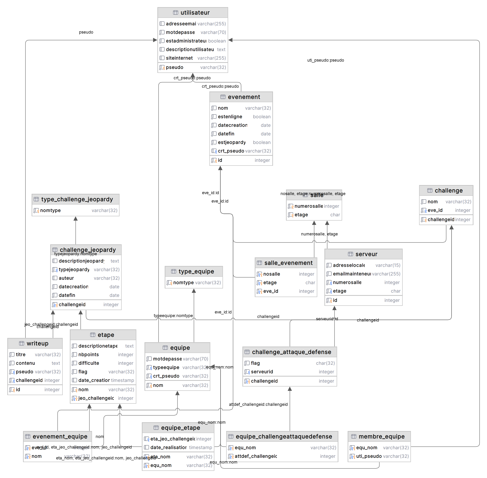

\newpage{}

# Introduction

Ce rapport présente le projet semestre de base de données relationnelles (BDR). Nous avons réalisé une application interagissant avec une base de données.

Le choix du thème et des technologies utilisées était libre hormis pour le SGBD qui était imposé : PostgreSQL. Nous avons donc choisi de faire un site web permettant de créer des évènements « CTF ». 

Un CTF est un jeu de piste informatique dans lequel les participants doivent résoudre des challenges informatiques principalement en lien avec la cybersecurité.

## Technologies utilisées

Nous avons utilisé PHP pour le backend du site et le framework Bootstrap accompagné d'un template « Neon Glow » pour le frontend. Nous n'avons pas utilisé de framework pour le backend, 
nous avons tout fait à la main. Nous avons utilisé PDO pour interagir avec la base de données depuis PHP.

# Cahier des charges

## Projet

Comme projet, nous avons décidé de faire une plateforme CTF (Capture the Flag). Il s’agit
d'événements de cyber-sécurité. Ils peuvent avoir lieu en ligne ou en présentiel. Afin de
participer à un CTF, une plateforme permet à des utilisateurs de se connecter et de fonder
des équipes. Les équipes peuvent participer à des CTF de plusieurs types : jeopardy et
attaque-défense.
Pour les CTF de types jeopardy : les utilisateurs doivent résoudre un maximum de
challenges de sécurité informatiques. Ces challenges peuvent être en plusieurs étapes (il
faut trouver un code appelé flag et le soumettre à un validateur), lorsqu’une équipe trouve un
flag, l’équipe remporte un nombre de points qui s’ajoute à ceux déjà obtenus durant le
challenge.
Pour les CTF de types attaque-défense : chaque équipe se voit attribuer une machine avec
un flag dedans qu’elle doit protéger, son but est de récupérer celui des autres équipes.

## Besoins en données

Afin de réaliser correctement ce projet, nous aurons besoin des données mentionnées
ci-dessous. La liste des données est divisée selon les différents acteurs et fonctionnalités
que nous souhaitons implémenter.

### Utilisateurs

Chaque utilisateur possède un compte qui est composé de son pseudonyme (unique), son
adresse e-mail (unique), un mot de passe, une description (optionnelle), l’URL de son site
internet (optionnel). Si l’utilisateur rejoint une équipe, celle-ci est aussi mentionnée sur son
profil.

Les utilisateurs peuvent avoir un rôle : user ou admin.

### Equipes

Une équipe possède un nom (unique), un mot de passe pour accéder à celle-ci, le
pseudonyme de son créateur, la liste de ses membres, un type (pro, student, etc…).

### Événements CTF

Un CTF a un nom et il peut être soit physique (hors-ligne), soit en ligne, s’il est physique,
des salles y sont attribuées. Il peut aussi être de deux types, soit attaque-défense, soit
jeopardy. L’événement est limité dans le temps.

### Challenges type attaque-défense
Un challenge de type attaque-défense possède, une équipe, un flag et un serveur.

### Challenges et étapes type jeopardy

Un challenge possède un nom (unique), une description, un type (réseau, programmation,
forensic, etc…), un auteur/créateur, une date de création, une date de fin et la liste des
étapes qui le compose.

Un challenge est composé de plusieurs étapes, chaque étape possède un nom (unique au
sein du challenge), une description, un nombre de points, un barème de difficulté (1-5) et un
flag (= un mot de passe) qui permet de valider le challenge.

### Salles
Une salle a un étage et un numéro associé.

### Serveurs

Certains challenges doivent être hébergés sur un serveur. Ces serveurs sont identifiés par
leur adresse locale, leur numéro d’identification, leur mainteneur ainsi que la salle dans
laquelle ils se trouvent.

### Writeups

Un writeup a un titre et un contenu. Il est lié à un challenge de type jeopardy en particulier et
à un utilisateur. Le writeup peut être écrit AVANT la fin de l'événement mais peut être
visible uniquement APRÈS la fin du CTF.

## Fonctionnalités

### Utilisateurs

Les utilisateurs peuvent créer des comptes et se connecter s’ils en possèdent déjà un.
Chaque compte utilisateur est unique, il ne doit donc pas y avoir deux fois soit le même
pseudonyme, soit la même adresse e-mail.

Un utilisateur peut créer une équipe et gérer celle-ci (détails dans le sous-chapitre sur les
équipes). Les autres utilisateurs peuvent rejoindre l’équipe en cherchant le nom de celle-ci
dans un outil de recherche et en rentrant le mot de passe qui lui est associé.

### Administrateur

 - Un administrateur peut créer des
challenges de type jeopardy pour les autres utilisateurs. Il dispose d’une interface où
il peut rentrer les détails de ceux-ci (détails dans le sous-chapitre sur les challenges)
 - Un administrateur peut créer des challenges de types attaques défense.
 - Un administrateur peut créer des évènements CTF.

### Équipes

Chaque utilisateur peut créer son équipe en rentrant les informations citées précédemment.
Les autres utilisateurs peuvent rejoindre celle-ci, s’ils possèdent le mot de passe associé. La
limite maximum de participants dans une équipe est de 4 membres (créateur compris).

Les créateurs peuvent gérer l’équipe, c’est-à-dire gérer les membres présents dans celle-ci
pour les virer si besoin. Ils peuvent aussi changer le mot de passe qui avait été fixé lors de
la création. Le créateur est celui qui inscrit l’équipe au différents événements.

Chaque équipe possède une page où on y voit affiché ses informations, les membres et les
points totaux qu’elle a pu acquérir en réalisant divers challenges.

### Challenges et étapes

Un administrateur commence par créer le challenge dans un premier temps en fournissant
les informations requises, puis dans un second temps, il ajoutera les étapes qui le
composent.

La fonctionnalité principale est la validation des challenges. Lorsqu’une équipe est inscrite,
elle possède l’opportunité de valider les diverses étapes qui composent le challenge en
rentrant le flag (un flag par étape pour les types CTF jeopardy, un flag par machine pour de
l’attaque-défense). Les points de l’étape sont ajoutés aux points courants que possède
l’équipe sur ce challenge. Une équipe ne pouvant pas valider plusieurs fois le même flag.

Il est important de préciser que le temps n’est pas infini, chaque challenge à une date à
laquelle il se termine. Après cette date, il n’est plus possible de soumettre de réponse pour
les étapes et le challenge est verrouillé.

### Writeups

À la fin d’un événement CTF de type jeopardy la liste des writeups s’affiche sur la page d’un
challenge.

# Schéma conceptuel

# Schéma relationnel

## `Evenement`

| Attribut       | Type        | Null | Signification                |
|----------------|-------------|------|------------------------------|
| \underline{id} | int         | Non  | Identifiant de l'événement   |
| nom            | varchar(32) | Non  | Nom de l'évènement           |
| estEnLigne     | bool        | Non  | Évenement en ligne ou non    |
| dateCreation   | date        | Non  | Date de début de l'évènement |
| dateFin        | date        | Non  | Date de fin de l'évènement   |
| estJeopardy    | bool        | Non  | Type d'évènement             |
| crt_pseudo     | varchar(32) | Non  | Pseudo du créateur           |

## `Utilisateur`

| Attribut               | Type         | Null | Signification                  |
|------------------------|--------------|------|--------------------------------|
| \underline{pseudo}     | varchar(32)  | Non  | Pseudo de l'utilisateur        |
| adresseEmail           | varchar(255) | Non  | Adresse email de l'utilisateur |
| motDePasse             | varchar(70)  | Non  | Mot de passe                   |
| estAdministrateur      | boolean      | Non  | Role administrateur            |
| descriptionutilisateur | text         | Oui  | Biographie, description        |
| siteInternet           | bool         | Oui  | Site internet de l'utilisateur |

## `Equipe`

| Attribut        | Type        | Null | Signification                        |
|-----------------|-------------|------|--------------------------------------|
| \underline{nom} | varchar(32) | Non  | Nom de l'équipe                      |
| motDePasse      | varchar(70) | Non  | Mot de passe pour rejoindre l'équipe |
| typeequipe      | varchar(32) | Non  | Type d'équipe (pro, student, other)  |
| crt_pseudo      | varchar(32) | Non  | Nom du créateur de l'équipe          |

## `Membre_Equipe`

| Attribut                | Type        | Null | Signification    |
|-------------------------|-------------|------|------------------|
| \underline{equ\_nom}    | varchar(32) | Non  | Nom de l'équipe  |
| \underline{uti\_pseudo} | varchar(32) | Non  | Pseudo du membre |

## `Salle`

| Attribut                | Type    | Null | Signification                 |
|-------------------------|---------|------|-------------------------------|
| \underline{numeroSalle} | int     | Non  | Le numéro de la salle         |
| \underline{etage}       | char(1) | Non  | L'étage où se trouve la salle |

## `Salle_Evenement`

| Attribut            | Type    | Null | Signification                 |
|---------------------|---------|------|-------------------------------|
| \underline{noSalle} | int     | Non  | Le numéro de la salle         |
| \underline{etage}   | char(1) | Non  | L'étage où se trouve la salle |
| \underline{eve\_id} | int     | Non  | L'identifiant de l'évènement  |

## `Serveur`

| Attribut          | Type         | Null | Signification                  |
|-------------------|--------------|------|--------------------------------|
| \underline{id}    | int          | Non  | Identifiant du serveur         |
| adresseLocale     | varchar(15)  | Non  | Adresse IP du serveur          |
| emailMainteneur   | varchar(255) | Non  | Email de contact du mainteneur |
| numeroSalle       | int          | Non  | Le numéro de la salle          |
| etage             | char(1)      | Non  | L'étage où se trouve la salle  |

## `Writeup`

| Attribut       | Type        | Null | Signification            |
|----------------|-------------|------|--------------------------|
| \underline{id} | int         | Non  | Identifiant du writeup   |
| titre          | varchar(32) | Non  | Titre du writeup         |
| contenu        | text        | Non  | Contenu du writeup       |
| pseudo         | varchar(32) | Non  | Pseudo de l'utilisateur  |
| challengeId    | int         | Non  | Identifiant du challenge |

## `Challenge`

| Attribut                | Type        | Null | Signification              |
|-------------------------|-------------|------|----------------------------|
| \underline{challengeId} | int         | Non  | Identifiant du challenge   |
| nom                     | varchar(32) | Non  | Nom du challenge           |
| eve_id                  | int         | Non  | Identifiant de l'évènement |

## `Challenge_Jeopardy`

| Attribut                | Type        | Null | Signification                 |
|-------------------------|-------------|------|-------------------------------|
| \underline{challengeId} | int         | Non  | Identifiant du challenge      |
| description             | text        | Non  | Description du challenge      |
| typejeopardy            | varchar(32) | Non  | Type de challenge             |
| auteur                  | varchar(32) | Non  | Nom et prénom de l'auteur     |
| dateCreation            | date        | Non  | Date de création du challenge |
| dateFin                 | date        | Non  | date de fin du challenge      |

## `Challenge_Attaque_Defense`

| Attribut                | Type        | Null | Signification            |
|-------------------------|-------------|------|--------------------------|
| \underline{challengeId} | int         | Non  | Identifiant du challenge |
| flag                    | varchar(32) | Non  | Flag du serveur          |
| \underline{id}          | int         | Non  | Identifiant du serveur   |

## `Etape`

| Attribut                     | Type        | Null | Signification                       |
|------------------------------|-------------|------|-------------------------------------|
| \underline{nom}              | varchar(32) | Non  | Nom du challenge                    |
| \underline{jeo\_challengeid} | int         | Non  | Identifiant du challenge parent     |
| description                  | text        | Non  | Description du challenge            |
| nbPoints                     | int         | Non  | Nombre de points du challenge       |
| difficulte                   | int         | Non  | Difficulte du challenge             |
| flag                         | varchar(32) | Non  | Flag de l'étape                     |
| date_creation                | date        | Non  | Date à laquelle l'étape a été créée |

## `Evenement_Equipe`

| Attribut            | Type        | Null | Signification              |
|---------------------|-------------|------|----------------------------|
| \underline{eve\_id} | int         | Non  | Identifiant de l'évènement |
| \underline{nom}     | varchar(32) | Non  | Nom de l'équipe            |

## `Equipe_Etape`

| Attribut                           | Type        | Null | Signification                                       |
|------------------------------------|-------------|------|-----------------------------------------------------|
| \underline{eta\_nom}               | varchar(32) | Non  | Nom du challenge                                    |
| \underline{eta\_jeo\_challengeid}  | int         | Non  | Identifiant du challenge auquel est assigné l'étape |
| \underline{equ\_nom}               | varchar(32) | Non  | Nom de l'équipe                                     |
| date_realisation                   | timestamp   | Non  | Date à laquelle l'étape a été validée               |

## `Equipe_ChallengeAttaqueDefense`

| Attribut                        | Type        | Null | Signification            |
|---------------------------------|-------------|------|--------------------------|
| \underline{attdef\_challengeid} | varchar(32) | Non  | Identifiant du challenge |
| \underline{equ\_nom}            | varchar(32) | Non  | Nom de l'équipe          |

## `Type_Challenge_Jeopardy`

| Attribut            | Type        | Null | Signification                     |
|---------------------|-------------|------|-----------------------------------|
| \underline{nomtype} | varchar(32) | Non  | Nom du type de challenge jeopardy |

## `Type_Equipe`

| Attribut            | Type        | Null | Signification        |
|---------------------|-------------|------|----------------------|
| \underline{nomtype} | varchar(32) | Non  | Nom du type d'équipe |

# Conclusion

## Étude des changements entre les phases
Lors de l'avancée de notre projet, nous avons étés confrontés plusieurs
fois à des obligations de changer notre cahier des charges ainsi que notre modélisation
afin qu'elle corresponde à nos besoin en SQL.

1. Dans le cahier des charges nous avons mis comme contrainte qu'une seule adresse email est possible par compte.
Nous avons décidé de ne pas implémenter ceci dans le cas ou un administrateur souhaite avoir un compte d'administration et
un compte d'utilisateur.
2. Nous discutions, dans le cahier des charges, l'implémentation d'un outil de recherche d'équipe. Celui-ci n'a pas été implémenté car
nous avons une liste d'équipes affichées.
3. Un créateur d'équipe ne peut pas changer le mot de passe de son équipe.
4. Une fonctionnalité que nous avons décidé d'implémenter en plus sont les différentes statistiques visibles sur la page d'accueil.
5. Le principe de challenge attaque défense n'a pas été complètement implémenté. En effet, la possibilité de protéger un serveur n'a pas été faite.

## Dernières considérations
En conclusion, ce projet a été l'occasion pour nous de mettre en pratique ce que nous avons appris
en matière de création de bases de données en utilisant PostgreSQL.
Nous avons eu l'opportunité de participer à toutes les étapes de la création d'une base de données,
de la définition du cahier des charges à la modélisation conceptuelle et relationnelle en passant par l'implémentation en SQL.
Nous avons également eu l'occasion d'appréhender les fonctionnalités avancées telles que les triggers et les vues,
et de comprendre leur utilité dans des situations concrètes.
Enfin, la création du site web et la mise en place de la connexion entre ce dernier et la base de données
nous ont permis d'avoir une vision globale de la façon dont une base de données peut être intégrée à un site web.
